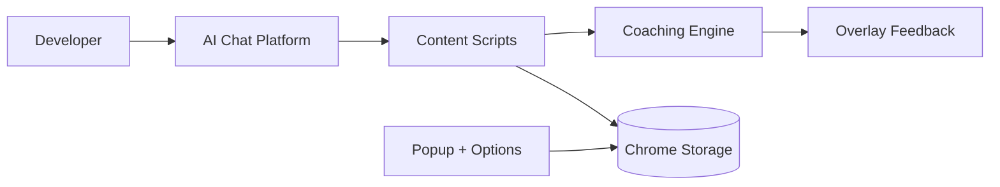

# System Design

AI Dev Coach is a client-side Chrome extension. All behavior analysis runs locally in the browser.

## High-Level Flow

## Core Components

- `content/monitor.js`: prompt event capture and quality analysis
- `content/interactionTracker.js`: copy-paste risk detection
- `content/aiOverlay.js`: in-page warning and coaching messages
- `popup/*`: profile onboarding and prompt generation templates
- `options/*`: thresholds and strict mode controls
- `background.js`: initial default state setup

## Data Storage

The extension stores only local state in `chrome.storage.local`:

- `profile`: role, level, habit goal
- `settings`: strict mode and warning thresholds
- `stats`: AI requests, manual attempts, large paste count
